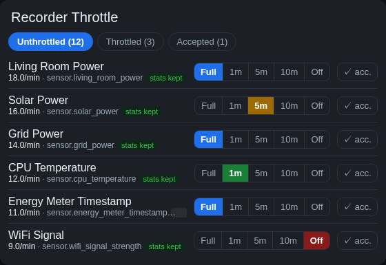

# Recorder Throttle

A Home Assistant custom integration that **throttles the recorder's database writes per entity** — e.g. "record this sensor at most once per minute". No second database, no second recorder; the live state, automations and UI are unaffected — only persistence is throttled.

Home Assistant only offers all-or-nothing per entity (`include`/`exclude`). This fills the gap: keep a **coarse history instead of none**, at a fraction of the write volume (DB size, disk wear, query load).



## Features
- **Per-entity time throttle** via labels: `rec-1min` · `rec-5min` · `rec-10min` · `rec-off` (never).
- **Management card** with tabs: **Unthrottled** (frequent writers, live writes/min) · **Throttled** · **Accepted**.
- **Repair report**: surfaces new, unthrottled heavy writers on the Repairs page (threshold configurable).
- **Statistics preserved**: long-term statistics (for `state_class` sensors) survive throttling **and** "off" (the statistics engine falls back to the live state) — the card shows `stats kept` / `no backup` per row.
- **Fail-safe**: if the recorder hook can't be installed, the recorder keeps running unthrottled.

## How it works
A fail-safe instance hook on `Recorder._process_state_changed_event_into_session`: state-change events of throttled entities are dropped in the recorder thread **before** the DB row is built. The state machine is never touched, so current state / automations / UI are unaffected — only the raw `states` rows are reduced.

> ⚠️ This relies on an internal recorder method. After Home Assistant core updates, do a quick smoke test (a throttled sensor + the log). On any error the integration does **not** patch and the recorder runs normally.

## Installation

### HACS (custom repository)
1. HACS → ⋮ → **Custom repositories** → add this repo, category **Integration**.
2. Install **Recorder Throttle**, then **restart** Home Assistant.
3. **Settings → Devices & Services → Add Integration → "Recorder Throttle"** (single instance). It creates the labels `rec-off/1min/5min/10min/accepted` and registers the services.

### Manual
Copy `custom_components/recorder_throttle/` into your `<config>/custom_components/`, restart, then add the integration as above.

## Management card (optional but recommended)
1. Copy `recorder-throttle-card.js` into `<config>/www/`.
2. **Settings → Dashboards → ⋮ → Resources → Add resource**
   - URL: `/local/recorder-throttle-card.js`
   - Type: **JavaScript Module**
3. Add the card to a dashboard:
   ```yaml
   type: custom:recorder-throttle-card
   title: Recorder Throttle
   hours: 1     # window for the live rate
   limit: 30    # max rows in the "Unthrottled" tab
   ```
   Then hard-reload (Ctrl+Shift+R).

## Usage
- In the card, pick a level per entity (**Full · 1m · 5m · 10m · Off**) — applies instantly (sets the matching `rec-*` label).
- **✓ acc.** marks a heavy writer as reviewed (label `rec-accepted`) so it stops being reported.
- Click an entity name for the more-info dialog.
- Without the card: set the label directly on the entity (Settings → entity → Labels).

## Settings (Devices & Services → Configure)
| Option | Default | Purpose |
|---|---|---|
| Scan for new heavy writers | on | enable/disable the Repair report |
| Threshold (writes/min) | 5 | when an unthrottled entity is reported |
| Scan interval (min) | 60 | how often to scan |
| Measurement window (h) | 1 | period for the rate measurement |

## Services
- `recorder_throttle.set_policy` (entity, policy: full/off/1min/5min/10min)
- `recorder_throttle.set_accepted` (entity, accepted: bool)
- `recorder_throttle.top_writers` (hours, limit, exclude_accepted) → response data
- `recorder_throttle.set_enabled` (kill switch) · `recorder_throttle.rebuild`

## Caveats
- Don't throttle **energy / `total_increasing`** or statistics-critical measurements too hard. Entities **without** statistics (text/binary) lose everything at "off" — the card warns with `no backup`.
- Throttling only coarsens the *intra-5-min* min/max/mean of measurement sensors; the 5-min/hourly statistics keep being produced.

## License
MIT — see [LICENSE](LICENSE).
