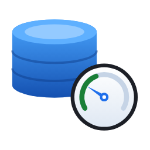
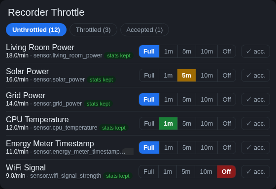

<p align="center">
  
</p>

# Recorder Throttle

[![HACS Custom][hacs-badge]][hacs-url]
[![GitHub Release][release-badge]][release-url]
[![Validate][validate-badge]][validate-url]
[![License: MIT][license-badge]][license-url]
[![Home Assistant][hass-badge]][hass-url]

[](https://my.home-assistant.io/redirect/hacs_repository/?owner=pos-ei-don&repository=ha-recorder-throttle&category=integration)

A Home Assistant custom integration that **throttles the recorder's database writes per entity** — e.g. "record this sensor at most once per minute". No second database, no second recorder; the live state, automations and UI are unaffected — only persistence is throttled.

Home Assistant only offers all-or-nothing per entity (`include`/`exclude`). This fills the gap: keep a **coarse history instead of none**, at a fraction of the write volume. Fewer `states` rows means a **smaller database on disk**, less SSD wear, lower query load, and **faster nightly purges** (the recorder has far fewer rows to delete).

> **Easy to try, easy to undo.** You can switch throttling off globally at any time with a single
> service call — instantly, without a restart and without uninstalling, and the setting sticks across
> restarts (see [Disabling throttling](#disabling-throttling)). That makes it safe to evaluate on a
> live system: if you don't like what you see, one call puts recording back exactly as it was.
> Removing the integration cleans up after itself — the dashboard resource for the card and the stored
> state go with it. Only the `rec-*` labels remain, because those are your throttling choices rather
> than our bookkeeping; delete them under Settings → Areas & Labels if you want nothing left at all.



## Features
- **Per-entity time throttle** via labels: `rec-1min` · `rec-5min` · `rec-10min` · `rec-off` (never).
- **Smaller, faster database**: fewer `states` rows → less disk usage and quicker recorder purges.
- **Management card** with tabs: **Unthrottled** (frequent writers, live writes/min) · **Throttled** · **Accepted**.
- **Repair report**: surfaces new, unthrottled heavy writers on the Repairs page (threshold configurable).
- **Statistics preserved**: long-term statistics (for `state_class` sensors) survive throttling **and** "off" (the statistics engine falls back to the live state) — the card shows `stats kept` / `no backup` per row.
- **Fail-safe**: if the recorder hook can't be installed, the recorder keeps running unthrottled.

## How it works
A fail-safe instance hook on `Recorder._process_state_changed_event_into_session`: state-change events of throttled entities are dropped in the recorder thread **before** the DB row is built. The state machine is never touched, so current state / automations / UI are unaffected — only the raw `states` rows are reduced.

> ⚠️ This relies on an internal recorder method. After Home Assistant core updates, do a quick smoke test (a throttled sensor + the log). On any error the integration does **not** patch and the recorder runs normally. If the recorder is reloaded at runtime (e.g. during development), the hook re-installs itself automatically within ~30s.

## Installation

### HACS (custom repository)
1. Click the **"Add repository to HACS"** button above — or in HACS → ⋮ → **Custom repositories** add this repo, category **Integration**.
2. Install **Recorder Throttle**, then **restart** Home Assistant.
3. **Settings → Devices & Services → Add Integration → "Recorder Throttle"** (single instance). It creates the labels `rec-off/1min/5min/10min/accepted` and registers the services.

### Manual
Copy `custom_components/recorder_throttle/` into your `<config>/custom_components/`, restart, then add the integration as above.

## Management card
The card **ships with the integration and loads automatically** — no manual dashboard resource needed. After installing + restarting, just add it to a dashboard (hard-reload with Ctrl+Shift+R first):

```yaml
type: custom:recorder-throttle-card
title: Recorder Throttle
hours: 1     # window for the live rate
limit: 30    # max rows in the "Unthrottled" tab
```

The card is localized: it shows German when Home Assistant's language is German, English otherwise.

> Manual-only setup (card without the integration, rare): copy `custom_components/recorder_throttle/recorder-throttle-card.js` to `<config>/www/` and add it as a **JavaScript Module** resource (`/local/recorder-throttle-card.js`).

## Usage
- In the card, pick a level per entity (**Full · 1m · 5m · 10m · Off**) — applies instantly (sets the matching `rec-*` label).
- **✓ acc.** marks a heavy writer as reviewed (label `rec-accepted`) so it stops being reported.
- Click an entity name for the more-info dialog.
- Without the card: set the label directly on the entity (Settings → entity → Labels).

## Settings (Devices & Services → Configure)
| Option | Default | Purpose |
|---|---|---|
| Scan for new heavy writers | on | enable/disable the Repair report |
| Threshold (writes/min) | 5 | when an unthrottled entity is reported |
| Scan interval (min) | 60 | how often to scan |
| Measurement window (h) | 1 | period for the rate measurement |

## Services
| Service | Parameters | What it does |
|---|---|---|
| `recorder_throttle.set_policy` | `entity`, `policy`: `full` / `off` / `1min` / `5min` / `10min` | Sets the level for one or more entities (writes the matching `rec-*` label). |
| `recorder_throttle.set_accepted` | `entity`, `accepted`: bool | Marks a heavy writer as reviewed so it stops being reported. |
| `recorder_throttle.top_writers` | `hours`, `limit`, `exclude_accepted` | Returns the busiest writers plus `totals` (dropped / passed). Response data. |
| `recorder_throttle.set_enabled` | `enabled`: bool | Enables or **disables throttling** globally — see below. |
| `recorder_throttle.rebuild` | — | Recomputes the policies from the current labels. |

### Disabling throttling

`recorder_throttle.set_enabled` with `enabled: false` turns throttling off globally and takes effect
**immediately** — no restart, no uninstall. Every state change is recorded again exactly as if the
integration were not installed. The integration stays loaded and your labels are preserved, so you can
switch back on at any time.

```yaml
action: recorder_throttle.set_enabled
data:
  enabled: false
```

The state **survives a restart** (since v1.0.0): if you switch throttling off, it stays off until you
switch it back on. On startup the integration logs a warning while throttling is disabled, so it does
not stay off unnoticed.

If the recorder hook cannot be installed at all — for example after a Home Assistant update that changes
recorder internals — the integration **fails open**: nothing is throttled, everything is recorded, and a
repair notice is raised.

## Database backends

The throttle hooks into the recorder **above** the database layer, so it does not care which backend you
use. Verified end-to-end with Home Assistant 2026.8:

| Backend | Throttling | `top_writers` |
|---|---|---|
| SQLite (Home Assistant default) | ✅ | ✅ |
| PostgreSQL | ✅ | ✅ |
| MariaDB / MySQL | ✅ | ✅ |

In each case a throttled entity dropped from ~30 writes/min to 1/min while untouched entities kept
recording at their normal rate.

## Caveats
- Don't throttle **energy / `total_increasing`** or statistics-critical measurements too hard. Entities **without** statistics (text/binary) lose everything at "off" — the card warns with `no backup`.
- Throttling only coarsens the *intra-5-min* min/max/mean of measurement sensors; the 5-min/hourly statistics keep being produced.

## Contributing
Issues and pull requests are welcome — see [CONTRIBUTING.md](CONTRIBUTING.md).

## License
MIT — see [LICENSE](LICENSE).

<!-- Badges -->
[hacs-badge]: https://img.shields.io/badge/HACS-Custom-41BDF5.svg?style=for-the-badge
[hacs-url]: https://github.com/hacs/integration
[release-badge]: https://img.shields.io/github/v/release/pos-ei-don/ha-recorder-throttle?style=for-the-badge
[release-url]: https://github.com/pos-ei-don/ha-recorder-throttle/releases
[validate-badge]: https://img.shields.io/github/actions/workflow/status/pos-ei-don/ha-recorder-throttle/validate.yml?branch=master&style=for-the-badge&label=validate
[validate-url]: https://github.com/pos-ei-don/ha-recorder-throttle/actions/workflows/validate.yml
[license-badge]: https://img.shields.io/github/license/pos-ei-don/ha-recorder-throttle?style=for-the-badge
[license-url]: https://github.com/pos-ei-don/ha-recorder-throttle/blob/master/LICENSE
[hass-badge]: https://img.shields.io/badge/Home%20Assistant-Integration-41BDF5.svg?style=for-the-badge&logo=home-assistant&logoColor=white
[hass-url]: https://www.home-assistant.io/
